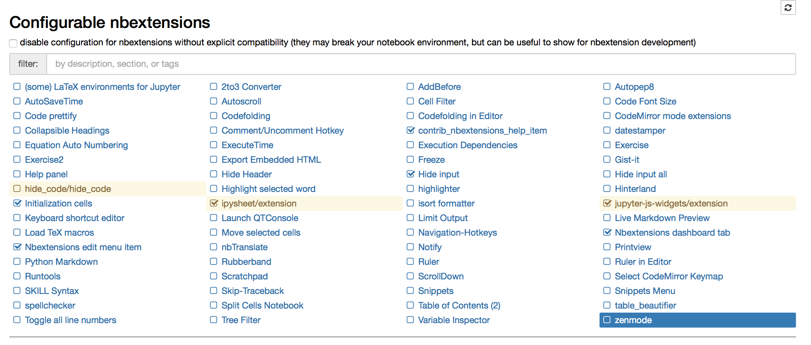

# Cosa fare una volta scaricato il tema d'esame?

1. Aprire il terminale e attivare l'environment ROexam digitando `conda activate ROexam`:

2. Controllare che il terminale sia attivo su ROexam:

3. Posizionarsi nella cartella dell'esame e avviarlo digitando `python avvia_esame.py`:

4. Verificare che si apra la mappa dell'esame analoga a quella rappresentata qui di seguito:

5. Per ogni esercizio, puoi aprire il corrispondente foglio Jupyter (offerto in modalità _Libera_, _Applet_ o _Verificatori_) cliccando sul link `Apri in Jupyter`:

6. Per ogni richiesta, puoi scrivere alcune note personali utili sia a te durante lo svolgimento dell'esame sia a noi per la correzione:

e puoi auto-valutarti, indicando quanti punti supponi di aver guadagnato:

__Controllo aggiuntivo:__
Apri il terminale, attiva l'ambiente ROexam e poi digita `jupyter-notebook`: nella homepage del server Jupyter deve essere presente la scheda `Nbextensions` (o `nb`) con i seguenti check:
- contrib\_nb\_extensions\_help\_item
- Hide input
- Initialization cells
- ipysheet/extensions
- jupyter-js-widgets/extensions
- Nbextensions edit menu item
- Nbextensions dashboard tab

