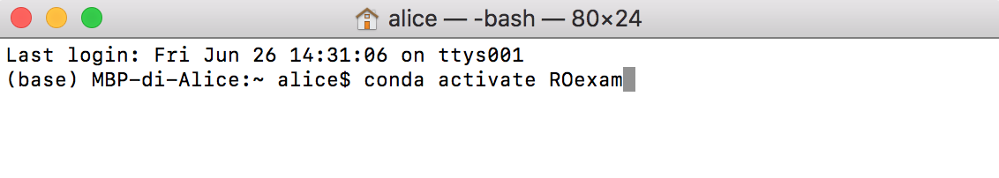
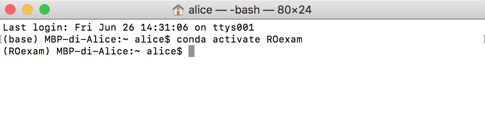
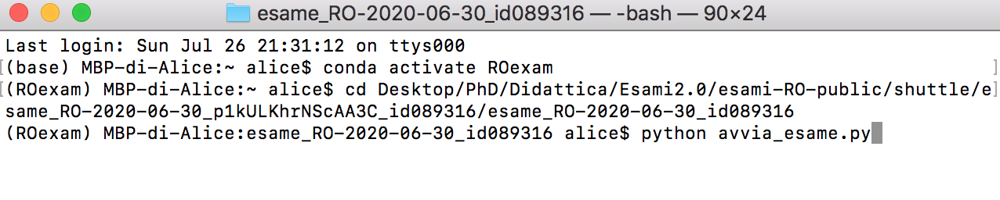
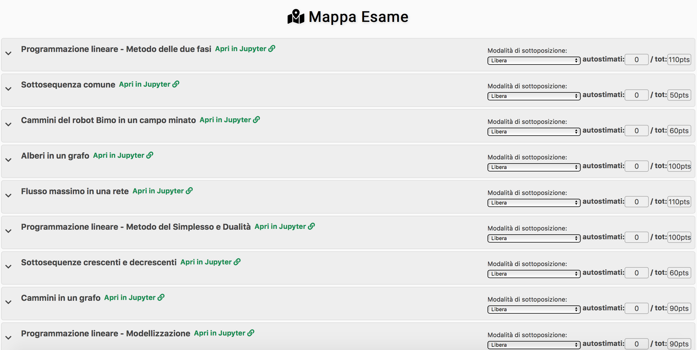
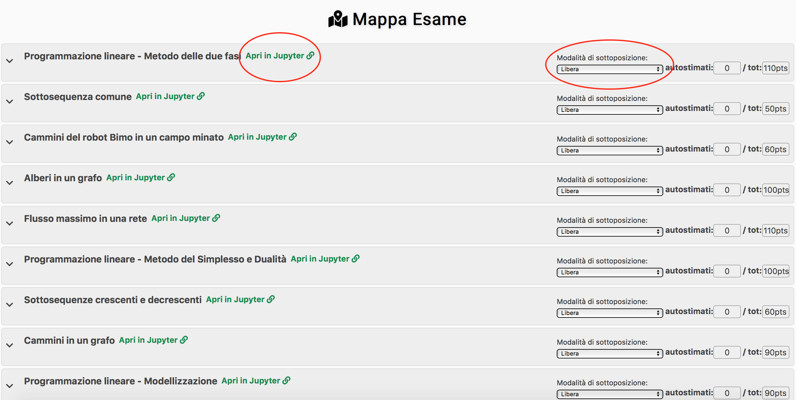
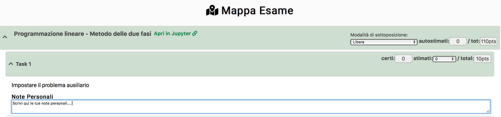
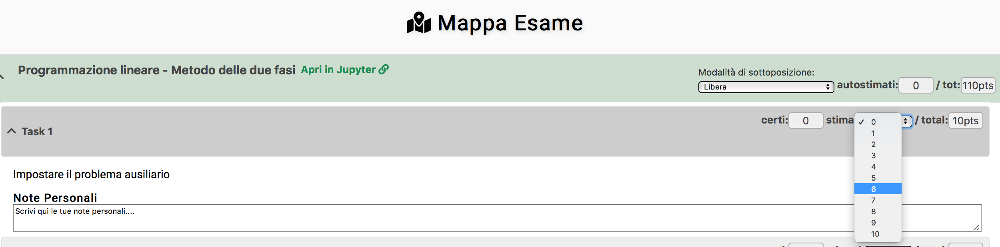

# Cosa fare una volta scaricato il tema d'esame?

1. Aprire il terminale e attivare l'environment ROexam digitando `conda activate ROexam`:

2. Controllare che il terminale sia attivo su ROexam:

3. Avviare l'esame digitando `python avvia_esame.py`:

4. Verificare che si apra la mappa dell'esame analoga a quella rappresentata qui di seguito:

5. Per ogni esercizio, puoi aprire il foglio Jupyter corrispondente selezionando la modalità di sottoposizione e poi cliccando sul link `Apri in Jupyter`:

6. Per ogni richiesta, puoi scrivere alcune note personali utili sia a te durante lo svolgimento dell'esame sia a noi per la correzione:

e puoi auto-valutarti, indicando quanti punti supponi di aver guadagnato:

