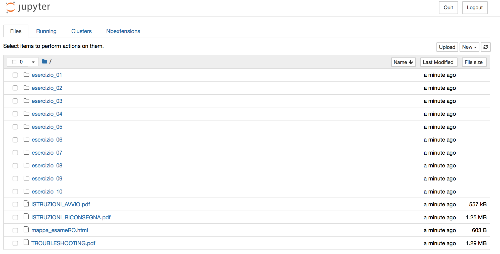

# Cosa fare una volta scaricato il tema d'esame?

1. Aprire il terminale e attivare l'environment ROexam digitando `conda activate ROexam`:

2. Controllare che il terminale sia attivo su ROexam:

3. Avviare il server Jupyter con il comando `jupyter-notebook` e controllare le seguenti NbExtensions:

4. Posizionarsi sulla cartella del tema d'esame:

5. Aprire il file _mappa_esameRO.html_ per avere informazioni sulle tipologie di esercizi:

