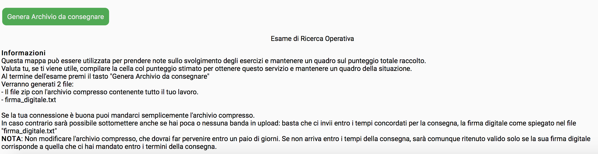
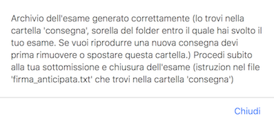
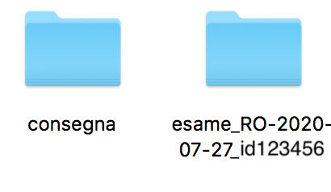
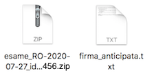
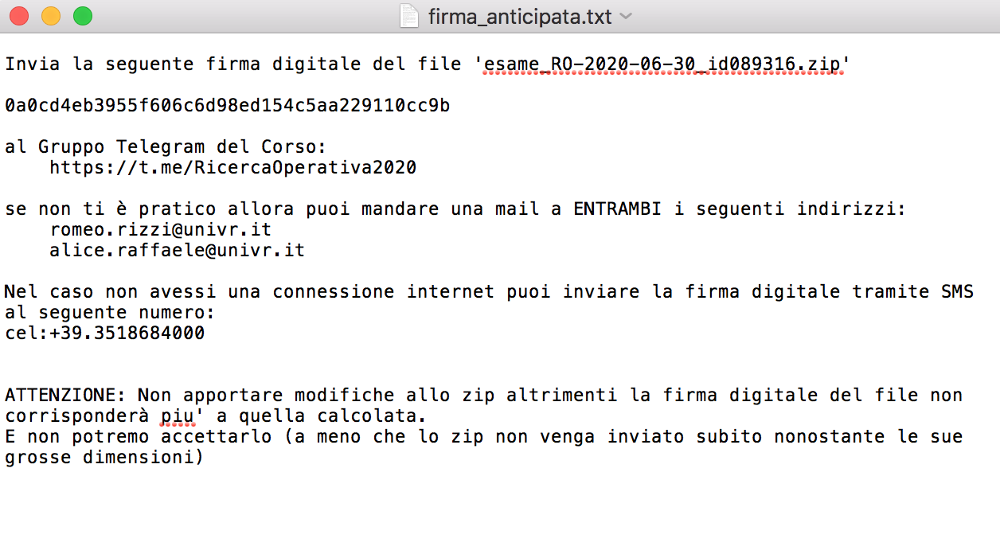
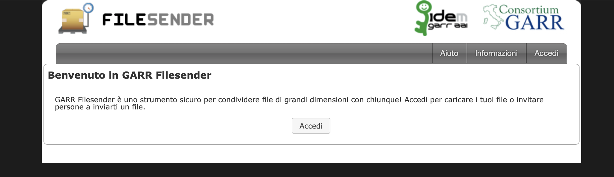
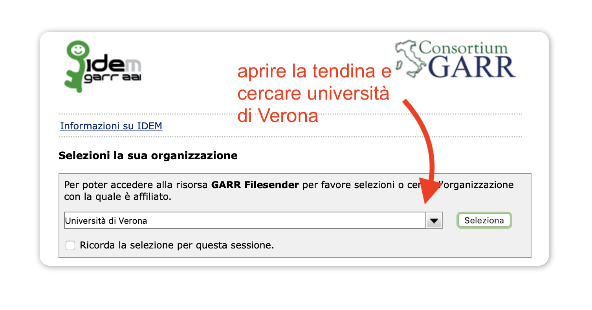
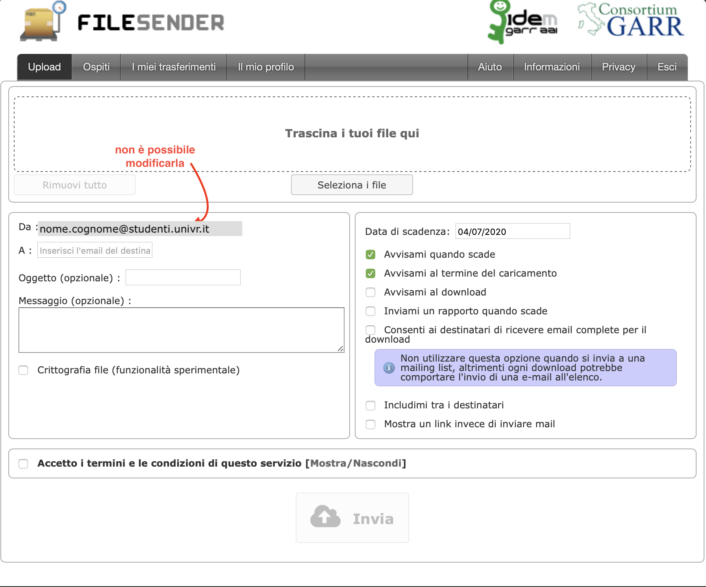
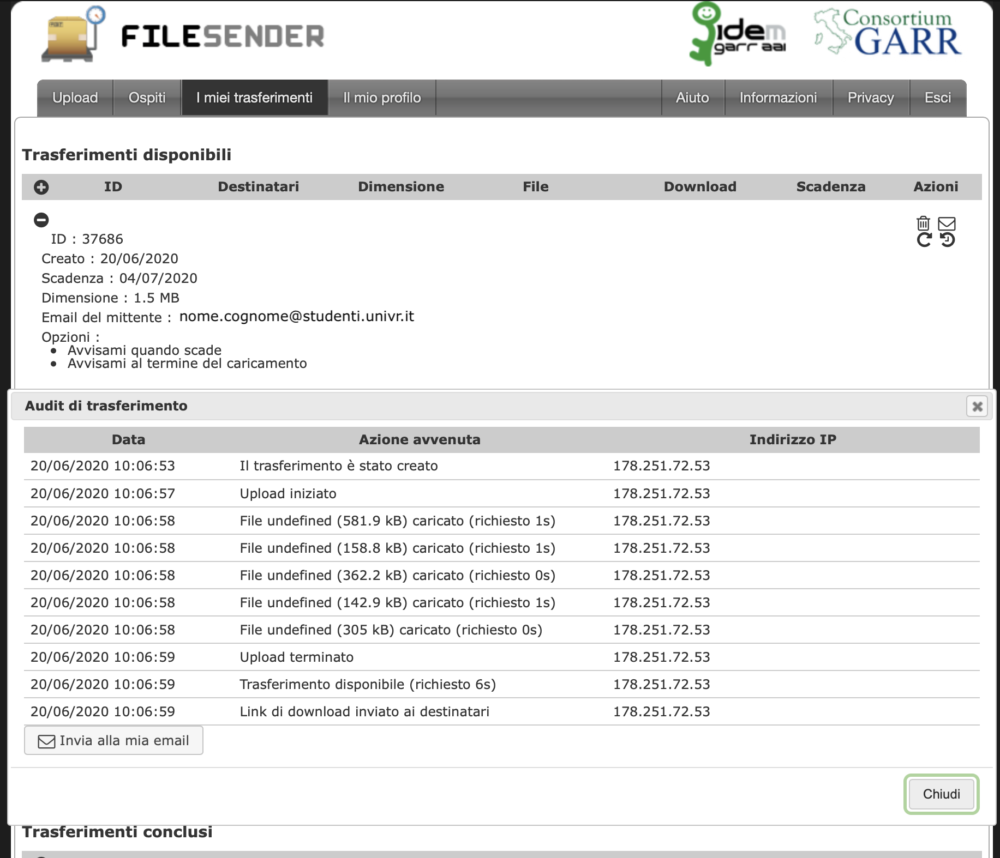
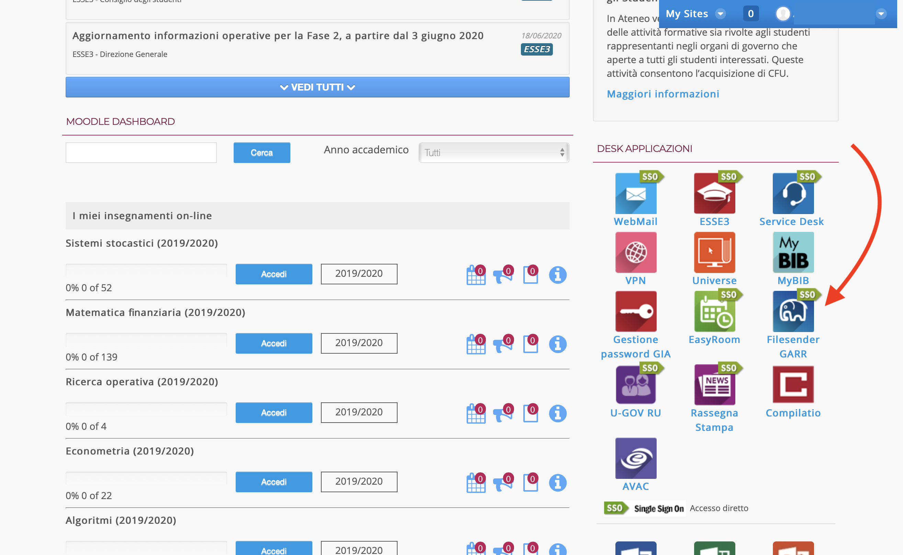

# COME CONSEGNARE IL TUO LAVORO AL TERMINE DELL'ESAME

La mappa ti avrà guidato nel comporre le tue risposte alle varie domande, assicurandosi che ogni materiale prodotto sia stato correttamente collocato entro la cartella del tuo esame in cui hai lavorato e che avevi scaricato ad inizio dell'esame.

Ora vuoi consegnare: in fondo alla mappa trovi il pulsante `Genera Archivio da consegnare`:



Cliccando, apparirà il seguente messaggio di avviso:



il quale ti informerà che è stata generata la cartella `consegna`:



La cartella conterrà due file, un archivio `.zip` e il file `firma_anticipata.txt`:



In particolare, `firma_anticipata.txt` riporterà le seguenti indicazioni:




## Come puoi farci avere questi file?

1. Puoi usare __FileSender__ (http://filesender.garr.it), chiedendo di recapitarlo alla sequenza di indirizzi mail
```
   romeo.rizzi@univr.it, alice.raffaele@univr.it
```
2. Oppure puoi provare a mandare in allegato un'__email__ a `romeo.rizzi@univr.it, alice.raffaele@univr.it`;
3. Se non riesci via e-mail, puoi provare un qualsiasi servizio online di __file sharing__ come per esempio https://www.mediafire.com e condividerci il link per scaricare i file;
4. Al limite, puoi mandarci __solo il file__ `firma_anticipata.txt` via e-mail o anche solo su Telegram, e farci avere poi con calma l'archivio `.zip` relativo.


La rimanente sezione del presente documento approfondisce come attrezzarsi per poter sfruttare FileSender.

## Invio di grossi file tramite il servizio GARR Filesender

Accedi a [Filesender GARR](https://wayf.idem.garr.it/WAYF?entityID=https%3A%2F%2Ffilesender.garr.it%2Fshibboleth&return=https%3A%2F%2Ffilesender.garr.it%2FShibboleth.sso%2FLogin%3FSAMLDS%3D1%26return%3Dhttps%253A%252F%252Ffilesender.garr.it%252F%253Fs%253Dupload%26target%3Dss%253Amem%253Aed4a8d42c54374b7e053e6c5b4dfa282c6052c1a622db2729ea7f08592780514) e, selezionata l'Università di Verona come il tuo ente di appartenenza, carica il file compresso `esameRO-2020.06.30-VR?????.7z` (o di altro formato ed estensione) per recapitarlo agli indirizzi mail:
```
   romeo.rizzi@univr.it, alice.raffaele@univr.it
```
Questo è quanto. Ma se ti abbiamo perso percorriamo ora insieme i passi necessari accompagnandoti coi nostri Screenshots.

Parti caricando lo URL [`https://filesender.garr.it/`](https://filesender.garr.it/)  dentro il tuo browser. Così facendo verrai accolto da una schermata di benvenuto:



Premuto il tasto "Accedi" (dove, a seconda di come configurato il tuo locale, potrebbe esserci stato scritto invece "Login"), ti viene chiesto di specificare l'ente consorziato a rete GARR attraverso le cui credenziali autenticarti ed accedere al servizio. Scegli l'Università di Verona.




Una volta scelta l'Università di Verona, potrai accedere al servizio inserendo le tue <b>credenziali GIA</b> esse sono quindi da noi richieste al momento della consegna mentre per poter scaricare il tuo tema individualizzato avrai dovuto utilizzare il link personale che ti avremo fatto avere per mail.

Non appena riconosciuto dal sistema potrai, se lo desideri, impostare le poche opzioni offerte a quel punto. Potrai inoltre inserire un tuo messaggio di accompagnamento.



Ma la cosa importante a questo punto è che tu abbia cura di inserire nel campo del destinatario la lista di indirizzi mail:
```
   romeo.rizzi@univr.it, alice.raffaele@univr.it
```

Devi inoltre avere cura di allegare i file che desideri inviare (a noi basta il compresso della cartella esameRO-data-matricola entro la quale avrai lavorato).

Solo dopo avere aggiunto tale allegato potrai accettare i termini di servizio del servizio per attivare poi il tasto "Invio", pigiando nell'area bassa della schermata dove la freccia bianca dentro la nuvola è l'icona che vorrebbe indicare l'upload.

Una volta concluso l'invio, cliccando su "I miei trasferimenti" e poi su "Vedi i log di trasferimento" ottieni una schermata analoga alla seguente. Essa ti offre conferma dell'avvenuto invio e potrà in qualche modo consentirti di certificarlo qualora qualcosa dovesse andare storto:



Alternativamente, puoi accedere al servizio GARR accedere_a_FilesenderGARR_da_MyUniVR_o_da_moodle da MyUniVR oppure da Moodle:


