# TROUBLESHOOTING - Errori comuni e come risolverli

__Indice__:
- A) Problemi all'apertura del foglio
- B) Problemi durante l'esecuzione
- C) Problemi con il salvataggio e l'esportazione del foglio in HTML

Se rilevate ulteriori issue non presenti su questo file, segnalateceli (magari allegando uno o più screenshot) mandando un'email agli indirizzi `romeo.rizzi@univr.it, alice.raffaele@univr.it`.

## A) Problemi all'apertura del foglio

1. __Trust Notebook__: all'apertura del foglio Jupyter potrebbe comparirvi il seguente messaggio:

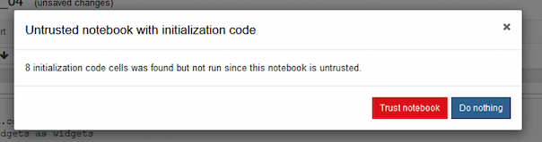

Cliccando su `Trust notebook`, apparirà un altro messaggio:

Cliccare ancora su `Trust`. Ciò consentirà al foglio Jupyter di eseguire in automatico, ogni volta che lo aprirete, le celle che importano le librerie necessarie, visualizzando anche il tasto `Avvio esercizio`.

2. __Package mancanti__: dopo aver cliccato `Avvio esercizio`, potrebbero comparire messaggi del genere relativi a dei package che, per qualche motivo, non sono stati caricati nell'environment di ROexam.

Per esempio:
- pulp:

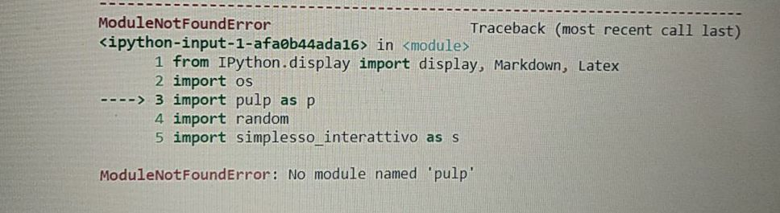

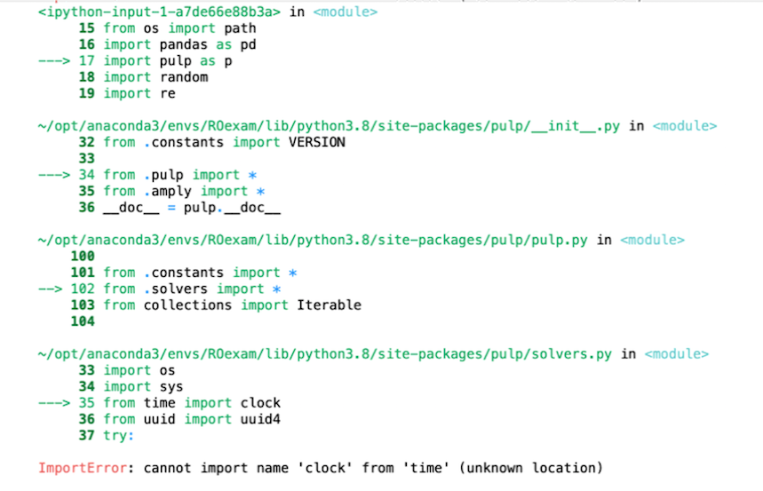

- ipysheet:

- numpy:

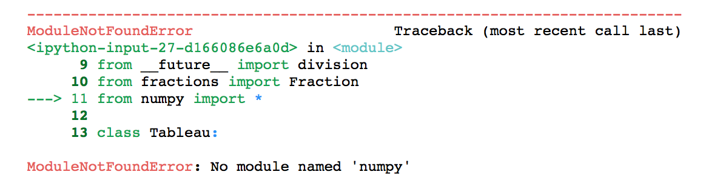

Per tutti questi casi, e analogamente per altri package, potete procedere in due modi:
1. Direttamente sul foglio Jupyter, aggiungere una cella di codice e digitare `! pip install --ignore-installed NOMEPACKAGE`, come con numpy nell'immagine qui sotto:

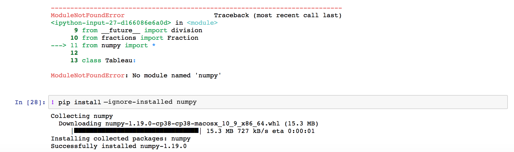

Il package indicato sarà quindi installato. A quel punto, provare a cliccare nuovamente `Avvio esercizio` e verificare che l'errore `no module named XXX` o altri correlati siano spariti.

2. Aprendo una nuova finestra di terminale, sempre con attivo l'environment ROexam, digitare il comando `pip install --ignore-installed NOMEPACKAGE`. Una volta conclusa l'installazione, tornare sul foglio Jupyter, andare sul menù Kernel e cliccare sulla voce `Restart  & Clear Output`.

__Nota__: può capitare che il nome del package non coincida completamente con il nome del modulo che dà errore (e.g., per usare il modulo yaml serve in realtà la libreria PyYaml ed è questo nome che dovrà essere in caso usato nel comando; controllare su Internet per accertarsene).

## B) Problemi durante l'esecuzione

1. __Kernel restart__: se d'un tratto alcune funzioni che andavano mostrano messaggi di errore strani, un buon modo di procedere può essere quello di riavviare il kernel (il motore) del foglio Jupyter. Ciò si può fare cliccando sul menù Kernel e sulla voce `Restart  & Clear Output`:

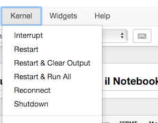

Se si vuole eseguire direttamente anche tutte le celle, si può cliccare invece su `Restart  & Run All`.

2. __Kernel shutdown__: se per qualche motivo si è chiusa la scheda del browser contenente il foglio Jupyter, si può provare a riaprirlo direttamente oppure a fare _shutdown_ del kernel ancora in esecuzione, andando sulla scheda `Running` e cliccando `Shutdown` del kernel relativo al foglio desiderato:

In seguito si può riaprire il foglio Jupyter e cliccare nuovamente su `Avvio esercizio` per ricaricare le celle necessarie e far sparire i codici.

3. __Codici nascosti__: se avete risposto a una o più richieste con delle celle codice e poi avete chiuso e riaperto il foglio Jupyter, allora potrebbe sembrarvi di non poter modificare più le vostre risposte in codice ma solo di visualizzarne l'output. In realtà i vostri codici sono ancora lì, ma per vederli dovrete prima cliccare sul bottone con l'occhio sbarrato:

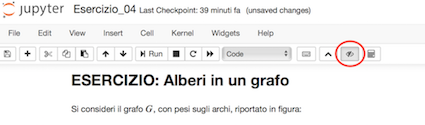

Modificate il vostro codice come preferite, eseguite la cella e poi potete tornare a nasconderne l'input cliccando nuovamente sull'occhio sbarrato.

4. __Celle codice di import visualizzate__: per qualche motivo potreste visualizzare celle di codice che dovrebbero restare nascoste:

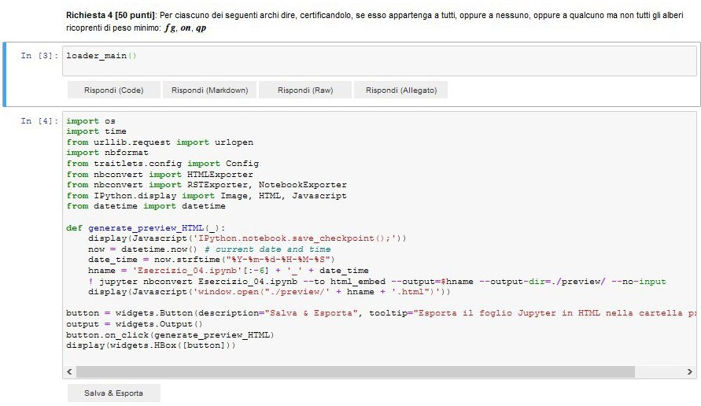

Per nasconderle nuovamente, potete cliccare su `Avvio esercizio` oppure sul bottone con l'occhio sbarrato:

5. __Jupyter Widget non visualizzati__: riaprendo il foglio dopo averlo chiuso, potrebbero non visualizzarsi i widget da usare per poter rispondere alle richieste dell'esercizio:

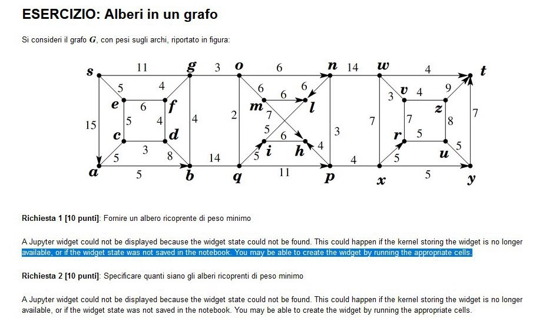

Anche in questo caso, cliccando su `Avvio esercizio` oppure nel menù Kernel la voce `Restart & Clear Output` dovrebbe tornare a visualizzarsi la barra con le possibili modalità di risposta.

6. __Run all initialization cells__: se per qualche motivo il bottone `Avvio esercizio` non funziona, si possono eseguire nuovamente tutte le celle di inizializzazione cliccando sul tasto seguente:

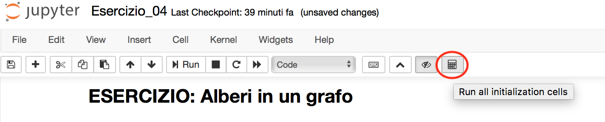

## C) Problemi con il salvataggio e l'esportazione del foglio in HTML

1. __Salva & Esporta__: cliccando sul bottone `Salva & Esporta` per creare la rendition in HTML del foglio Jupyter, su alcuni browser sembra che l'esecuzione della funzione sia errata, perché i messaggi di log appaiono su sfondo rosso, come nell'immagine seguente:

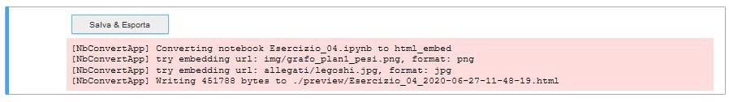

In realtà in questo caso è tutto a posto. I messaggi di log infatti si riferiscono alla conversione del foglio .ipynb in un .html, all'inserimento delle eventuali immagini presenti nel foglio e alla scrittura vera e propria del file .html nella sottocartella preview.

2. __Popup__: se non ci sono stati problemi, la funzione `Salva & Esporta` termina con l'apertura di una nuova scheda del browser per visualizzare il file .html appena creato. Alcuni browser potrebbero mostrare un avviso indicante il blocco delle finestre popup oppure il simbolo della finestra bloccata:

- Firefox e Chrome:

- Safari:
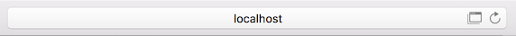

Per aprire il file .html, semplicemente cliccare sul messaggio di avviso e dare i consensi necessari oppure fare click sul simbolo della finestra bloccata:

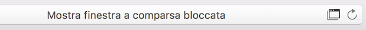

3. __404 Not Found__: se qualcosa è andato storto nella creazione della rendition in .html, la finestra popup che si apre mostrerà l'errore seguente:

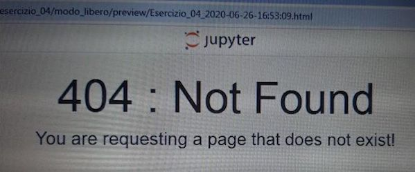

Controllate quindi il messaggio di errore che sarà indicato nel foglio Jupyter sotto il bottone `Salva & Esporta`. Potrebbe essere qualcosa del genere:

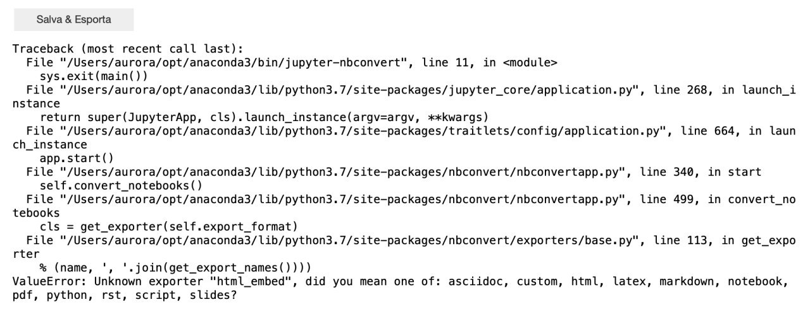

In questo caso, procedere come nel problema 2 della sezione A: inserire una nuova cella codice e digitare `! pip install --ignore-installed jupyter-contrib-nbextensions && jupyter contrib nbextension install --user` per re-installare il package `jupyter-contrib-nbextensions`. Chiudere tutto (compreso il terminale) e riavviare Jupyter. Controllare che, nella home page del server Jupyter, sia presente la scheda `nb` con i seguenti check:

Infine riprovare a esportare il foglio in .html.
